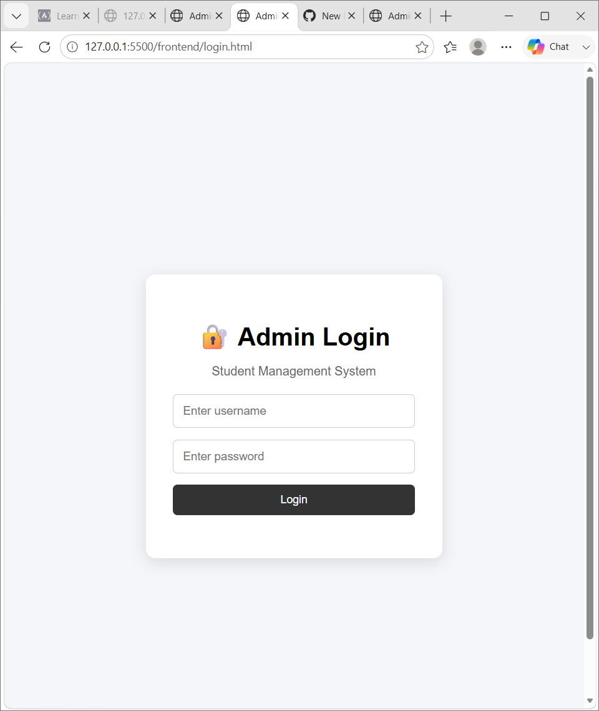
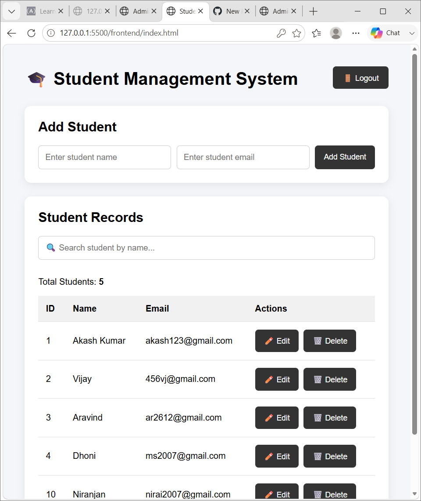

# 🎓 Student Management System

A simple and user-friendly **Student Management System** developed as a full-stack web application using **HTML, CSS, JavaScript, Python Flask, and MySQL**.

The system allows an administrator to log in and manage student records through a web-based dashboard.

---

## 📌 Features

- 🔐 Admin Login
- 🚪 Admin Logout
- 👨‍🎓 Add Student
- 📋 View Student Records
- ✏️ Update Student Details
- 🗑️ Delete Student Records
- 🔍 Search Student by Name
- 📧 Email Validation
- 🗄️ MySQL Database Integration
- 🌐 Flask REST API
- 🔒 Environment Variables for Sensitive Configuration
- 💻 User-Friendly Interface

---

## 🛠️ Technologies Used

### Frontend

- HTML5
- CSS3
- JavaScript

### Backend

- Python
- Flask
- Flask-CORS

### Database

- MySQL

### Configuration

- python-dotenv

---

## 🖥️ Screenshots

### 🔐 Admin Login

<p align="center">
  
</p>

### 🎓 Student Management Dashboard

<p align="center">
  
</p>

---

## 📂 Project Structure

```text
student-management-system/
│
├── README.md
├── .gitignore
│
├── screenshots/
│   ├── login.png
│   └── dashboard.png
│
├── frontend/
│   ├── index.html
│   ├── login.html
│   ├── script.js
│   └── style.css
│
└── backend/
    └── app.py
```

---

## 👨‍💻 Author

### Firthous S

**Computer Science and Engineering Student**

### 💡 Areas of Interest

- 🤖 Artificial Intelligence
- 📊 Data Science
- 📈 Data Analytics
- 🌐 Web Development

---

## ⭐ Acknowledgement

This project was developed as a learning project to gain practical experience in:

- 💻 Full-Stack Web Development
- 🐍 Python Flask
- 🌐 REST API Development
- 🗄️ MySQL Database Integration
- 🔐 Authentication
- 🔄 CRUD Operations

---
